# Unit 20 - Solidity Smart Contracts

## Resources
[Remix IDE](https://remix.ethereum.org) is used to create three `ProfitSplitter` contracts 
[Ganache](https://www.trufflesuite.com/ganache) development chain used to connect to MetaMask `localhost:8545` 
 

## Building Smart Contracts
### [`AssociateProfitSplitter.sol`](Starter-Code/AssociateProfitSplitter.sol) 
**Level One** is an `AssociateProfitSplitter` contract that uses Ether in the contract to divide and evenly transfer payment to 3 Associate-level employees.  Each employee variable is defined and set to payable. A constructor function is used to call the employee addresses to pay.  A balance function is set to return any remaining balance to the sender (Human Resources). The following steps were followed to execute the contract: 

`AssociateProfitSplitter` contract compiled:

 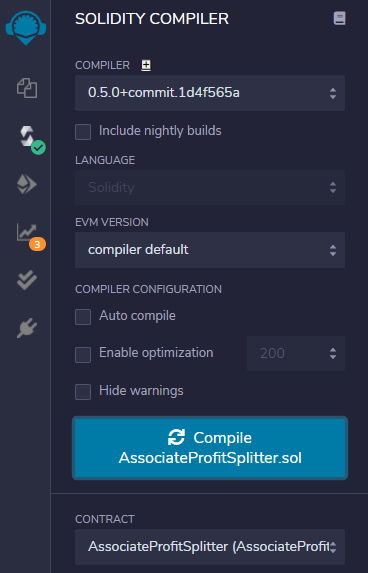

The contract deposit function is tested when the contract is deployed to ensure Ether is sent to the contract and returns `0`.  The contract is deployed by connecting to `Ganache` using the `Injected Web3` environment and connecting to MetaMask `localhost:8545`, an address from `Ganache` is entered for each employee with the value set to `0 ether`.  

`AssociateProfitSplitter` contract deployed:

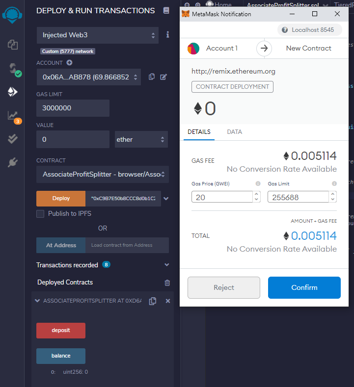

Once the contract is deployed, the `function() external payable` sends the Ether directly to the contract to test the `deposit`. 

`AssociateProfitSplitter` contract tested:

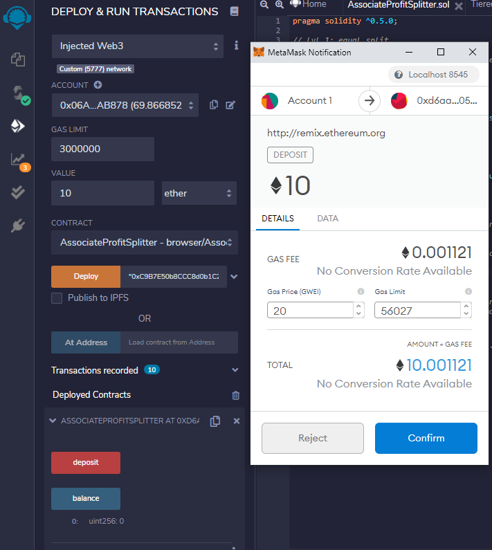

The `deposit` is verified in `Ganache` showing an even split transfer of the amount to each employee address.  

`AssociateProfitSplitter` employee balances pre-test:

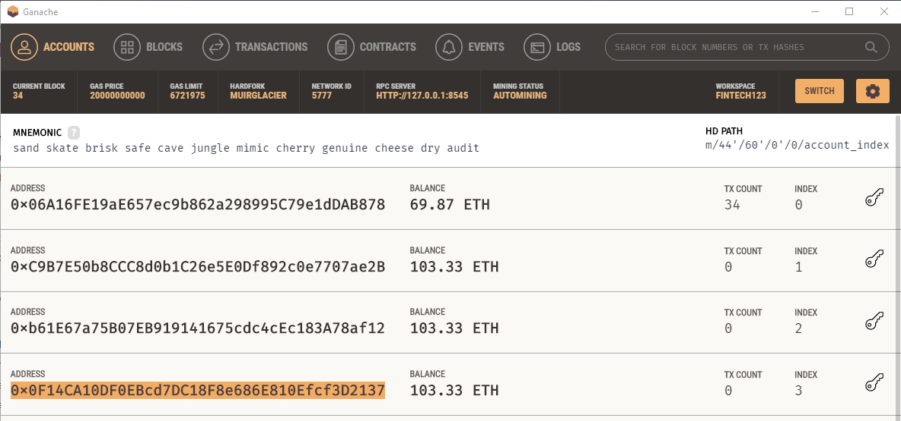

`AssociateProfitSplitter` employee balances after test transaction:

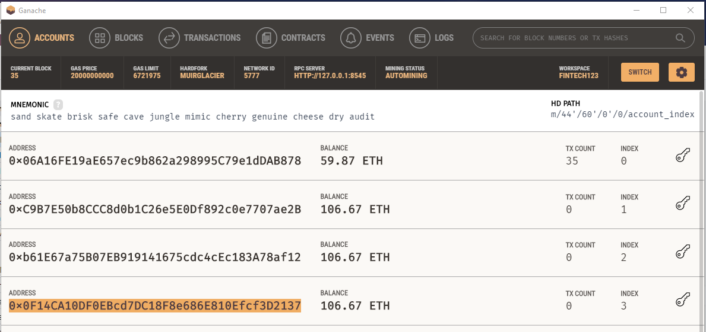

### [`TieredProfitSplitter.sol`](Starter-Code/TieredProfitSplitter.sol)
**Level Two** is a `TieredProfitSplitter` contract that is built on the `AssociateProfitSplitter` contract by adding a `deposit` function to distribute different percentages of profit (Ether) to employees at different tiers.  The value(points) is divided by `100` and multiplied by the percentage assigned to each employee to determine the amount to transfer to each employee.  The amount to transfer to each employee is added to a running total and the employee's tier is calculated using the remaining balance multiplied by the assigned percentage.  The balance function is set to send any remaining balance to employee_one with the highest assigned percentage. The following steps were followed to execute the contract:

`TieredProfitSplitter` contract compiled:

 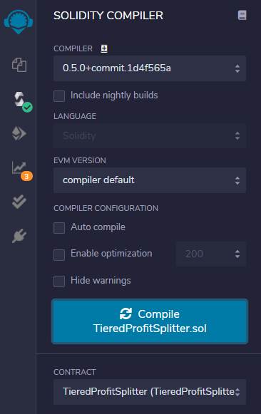

The contract deposit function is tested when the contract is deployed to ensure the Ether is sent to the contract and returns `0`.  The contract is deployed by connecting to `Ganache` using the `Injected Web3` environment and connecting to MetaMask `localhost:8545`, an address from `Ganache` is entered for each employee with the value set to `0 ether`.  

`TieredProfitSplitter` contract deployed:

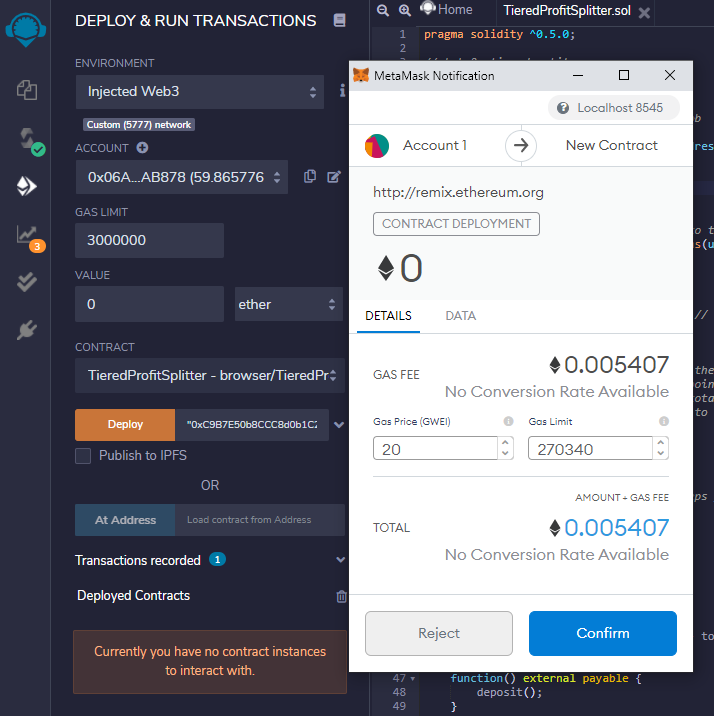

Once the contract is deployed, the `function() external payable` sends the Ether directly to the contract to test the `deposit`. 

`TieredProfitSplitter` contract tested:

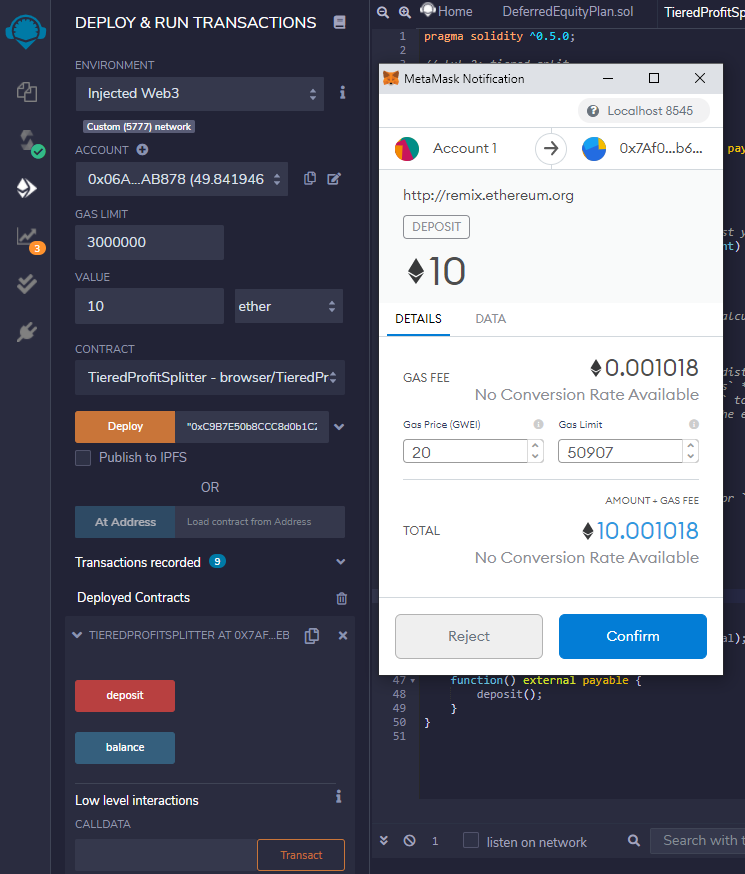

The `deposit` is verified in `Ganache` showing the correct percentage transfer for each employee address (60%, 25%, 15%).  The balance for the highest employee_one indicates that only 60% was transferred and that the balance function would have returned `0` since no additional amount was transferred to employee_one.  

`TieredProfitSplitter` employee balances after test transaction:

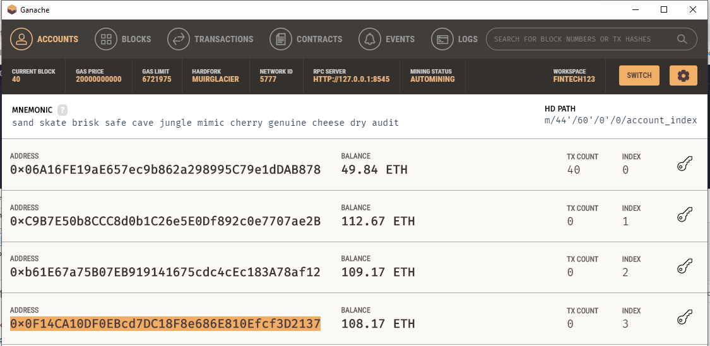

### [`DeferredEquityPlan.sol`](Starter-Code/DeferredEquityPlan.sol)
**Level Three** is a `DeferredEquityPlan` contract for a traditional company stock plan to store 1000 shares to be distributed evenly over a 4 year vesting period to a single employee. The variables are set for the total shares of 1000 to be distributed annually at 250 shares over the employment period with a safeguard in place to 1) not distribute any remaining (“unvested”) shares if the employee leaves the company before fully vesting or has not met the contract vesting period and 2) not to distribute shares that exceed the 1000 total shares.  The following variables were set:
  * `uint start_time = now` sets the contract start date to begin the employee vesting period
  * `unlock_time` sets the incremental distribution period based on the start date plus 365 days for an annual distribution
  * `uint public distributed_shares` tracks total shares distrubted to the employee over the vested period

The function `distribute` calculates the total shares that have been distributed over the vested period beginning with the `start_time`.  The `require` statements are used to calculate the next year's `unlock_time` to authorize the contract to release the next distribution of shares if it is not less than one year since the last distribution and the total available shares have not been distributed.  An `if` statement is included to check if the employee cashes out after the vesting period (based on the contract `start_time`) and that the shares distributed do not exceed the `total_shares` of the contract.  The following steps are used to execute the contract:

`DeferredEquityPlan` contract compiled:

 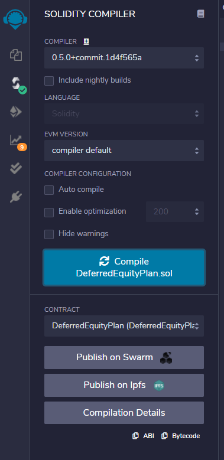

`DeferredEquityPlan` contract deployed:

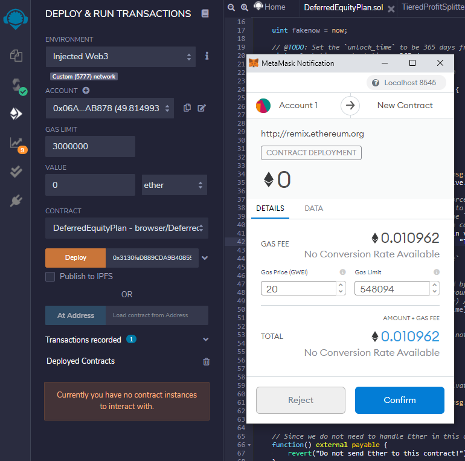

The timelock functionality is tested using the variable `uint fakenow = now` and the function `fastforward` to confirm that the contract restricts distribution of shares until the future date set in the contract.  Once the contract is deployed, the `function() external payable` reverts any Ether sent directly to the contract. 

`DeferredEquityPlan` contract tested and `0` shares distributed:

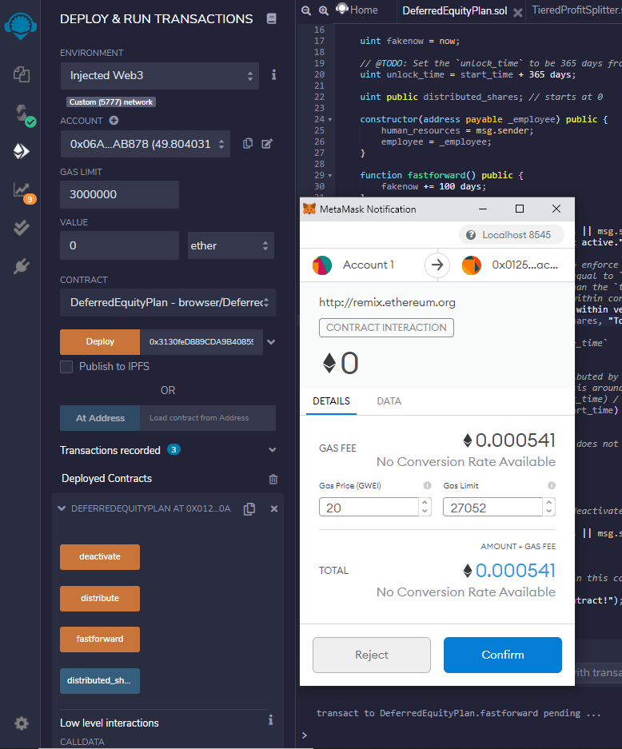

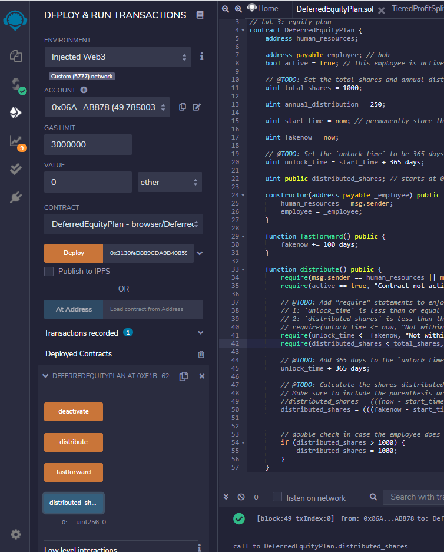

### **Contracts Deployed to Kovan Testnet**

`AssociateProfitSplitter` contract deployed:

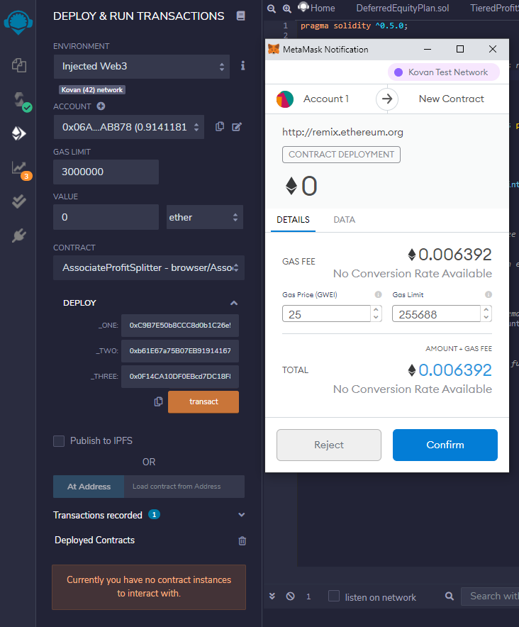

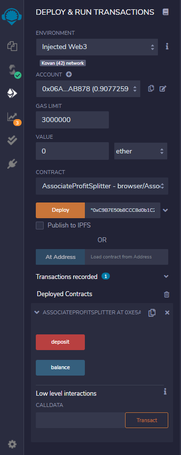

`TieredProfitSplitter` contract deployed:

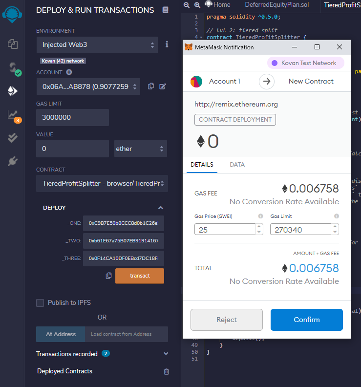

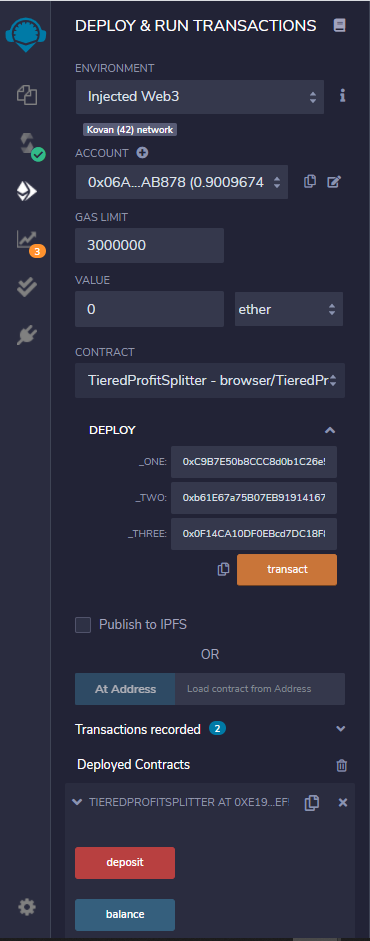

`DeferredEquityPlan` contract deployed:

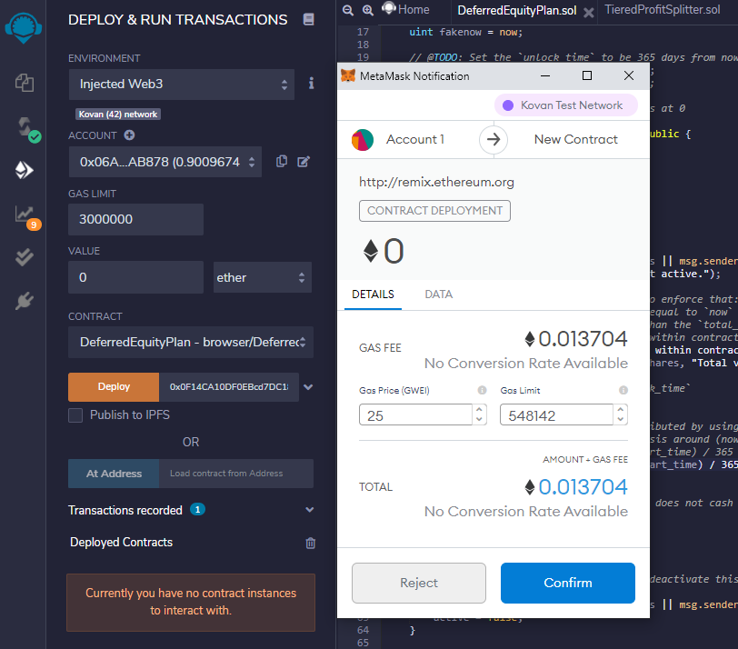

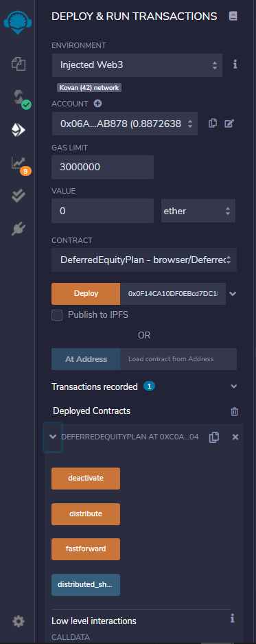
